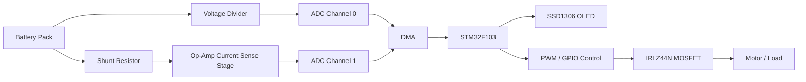

# Battery Management System

A custom battery management and motor protection project built around an STM32F103 microcontroller, a discrete sensing circuit, and an SSD1306 OLED display. The design uses direct hardware sensing instead of ready-made modules, so the full power path, current sensing, and fail-safe behavior are under our control.

---

## Preview

---

## What This Project Does

This project monitors battery voltage and current, estimates power and energy, displays live values on an OLED, and uses a MOSFET-based fail-safe to disconnect the load when current exceeds a safety threshold.

The system does three major jobs:

- Measures battery voltage through a voltage divider.
- Measures current through a shunt resistor and op-amp sensing stage.
- Controls an IRLZ44N MOSFET as a software-driven switch with fail-safe protection.

---

## Why We Built a Circuit Instead of Using Modules

Instead of relying on prebuilt sensing modules, we used a custom circuit design because:

- It gives direct control over sensing accuracy and thresholds.
- It makes the fail-safe path easier to tune for our exact battery and motor setup.
- It avoids hidden behavior inside generic modules.
- It lets us integrate sensing, switching, and display logic into one system.
- It is easier to study, debug, and explain as a complete embedded design.

This approach is more educational and more flexible for future expansion.

---

## Hardware Architecture

### 1. Voltage Sensing With a Divider

Battery voltage is higher than the STM32 ADC input range, so we scale it down using a resistor divider.

- The divider converts the battery voltage to a safe ADC level.
- The firmware then reconstructs the original battery voltage using the divider ratio.
- In code, the voltage is read from `ADC_CHANNEL_0`.

Conceptually:

$$
V_{adc} = V_{battery} \times \frac{R_2}{R_1 + R_2}
$$

And the firmware recovers battery voltage as:

$$
V_{battery} = V_{adc} \times \frac{R_1 + R_2}{R_2}
$$

### 2. Current Sensing With a Shunt Resistor

Current is measured using a low-value shunt resistor placed in the current path.

- When motor current flows, a small voltage drop appears across the shunt.
- That tiny voltage is amplified by the op-amp stage.
- The amplified signal is read by the ADC.

Conceptually:

$$
V_{shunt} = I \times R_{shunt}
$$

Then the op-amp scales that voltage so the STM32 can read it reliably.

### 3. Op-Amp Current Sense Stage

The op-amp stage is used to boost the small shunt voltage into a useful ADC range.

- It improves measurement resolution.
- It allows the ADC to detect small currents.
- It also needs correct biasing and feedback so it does not saturate.

If the output rails near the supply voltage, the measured current can appear falsely high. That is why the sensing circuit and its offset behavior matter.

### 4. IRLZ44N MOSFET Fail-Safe

The IRLZ44N is used as the power switch for the load.

- GPIO HIGH turns the MOSFET on.
- GPIO LOW turns the MOSFET off.
- A pull-down resistor on the gate keeps the MOSFET off by default.
- The firmware can shut the MOSFET off when overcurrent is detected.

This gives us a hardware fail-safe that reacts quickly and does not depend on a separate relay module.

### 5. PWM Used as a Switch Control Signal

Although the pin is configured through the GPIO output path, the design concept is the same as using a PWM-capable pin as a controlled output:

- The MCU asserts the gate control line to enable the MOSFET.
- The MCU deasserts the gate control line to disable the MOSFET.
- The gate is treated as a digital switch control input.

In this project, the important behavior is on/off switching, not duty-cycle modulation.

### 6. ADC With Two Channels

The STM32 ADC is configured with two regular conversions:

- `ADC_CHANNEL_0` reads battery voltage.
- `ADC_CHANNEL_1` reads current-sense output.

This lets us continuously collect both values from a single ADC peripheral.

### 7. DMA for Automatic Data Collection

DMA transfers ADC data directly into memory without CPU intervention.

- This reduces CPU load.
- It keeps the sampling continuous.
- It makes the readings easier to process in the main loop.

The ADC is started with DMA in `main.c`, and the sampled values are stored in `adc_buffer[2]`.

---

## Firmware Flow

The firmware follows this flow:

1. Initialize HAL and the clock tree.
2. Initialize GPIO, DMA, ADC, timer, and I2C.
3. Start ADC + DMA acquisition.
4. Start the gate-control output.
5. Initialize the OLED.
6. In the main loop:
   - Read current channel value.
   - Convert it into current.
   - Trip fail-safe if current is too high.
   - Read voltage channel value.
   - Convert it into battery voltage.
   - Calculate power.
   - Accumulate energy and charge.
   - Update the OLED.

---

## Main HAL Functions Used

### Initialization

- `HAL_Init()` initializes the HAL library and system tick.
- `SystemClock_Config()` configures the MCU clock tree.
- `MX_GPIO_Init()` configures GPIO pins.
- `MX_DMA_Init()` configures DMA.
- `MX_ADC1_Init()` configures ADC1.
- `MX_TIM1_Init()` configures the timer used by the project.
- `MX_I2C1_Init()` configures I2C for the OLED.

### Runtime

- `HAL_ADC_Start_DMA()` starts continuous ADC acquisition into memory.
- `HAL_GPIO_WritePin()` drives the MOSFET gate HIGH or LOW.
- `HAL_GetTick()` provides elapsed time for energy integration.
- `HAL_Delay()` controls display refresh timing.

### Display

- `OLED_Init()` initializes the SSD1306 display.
- `OLED_ShowMetrics()` writes the live metrics to the screen.

---

## Live Data Processing

The firmware converts raw ADC readings into physical values.

### Voltage

The voltage divider reading is converted to battery voltage using the divider ratio.

### Current

The current-sense channel is converted into current using:

$$
I = \frac{V_{sense}}{G \times R_{shunt}}
$$

Where:

- $V_{sense}$ is the op-amp output voltage.
- $G$ is the op-amp gain.
- $R_{shunt}$ is the shunt resistor value.

### Power

Power is calculated as:

$$
P = V_{battery} \times I_{battery}
$$

### Energy and Charge

The firmware integrates over time to estimate accumulated energy and charge.

---

## OLED Display Layout

The display shows the most important values in a compact status format.

Example style:

- `I/V: 400.0mA, 7.23V`
- `P: 2.89W`
- `E: 0.031Wh`
- `Q: 0.004Ah`
- `SoC: 98%`

When the fail-safe trips, the top line changes to indicate the protected state.

---

## Project Files

- `Core/Src/main.c` - main application, sensing logic, control logic, and fail-safe
- `Core/Src/adc.c` - ADC and DMA configuration
- `Core/Src/oled.c` - OLED rendering logic
- `Core/Inc/oled.h` - OLED function declarations
- `Core/Inc/adc.h` - ADC declarations

---

## Notes on Fail-Safe Behavior

The MOSFET gate is designed to stay low unless the software explicitly enables it.

- External pull-down resistor keeps the gate low by default.
- GPIO push-pull mode lets the MCU drive the gate high or low.
- If the current exceeds the threshold, the firmware drives the gate low.
- This creates a simple and effective protection path.

---

## Build Environment

This project is set up for STM32 HAL firmware development in Keil MDK.

Typical flow:

1. Open the project in Keil.
2. Build the target.
3. Flash the STM32 board.
4. Watch live voltage, current, power, and energy on the OLED.

---

## Possible Improvements

- Add current zero-offset calibration at startup.
- Add moving-average filtering for ADC noise.
- Add undervoltage and overtemperature protection.
- Add alarm icons or status bars on the OLED.
- Add logging over UART for debugging.

---

## Summary

This project combines:

- A custom sensing circuit instead of a ready-made module.
- A shunt resistor and op-amp current-sense stage.
- A voltage divider for safe battery voltage measurement.
- ADC + DMA for continuous data acquisition.
- An IRLZ44N MOSFET for fast software-controlled fail-safe switching.
- An SSD1306 OLED for live monitoring.
- STM32 HAL firmware to connect everything together.

The result is a compact battery management and protection system that is easy to study, expand, and demonstrate.
